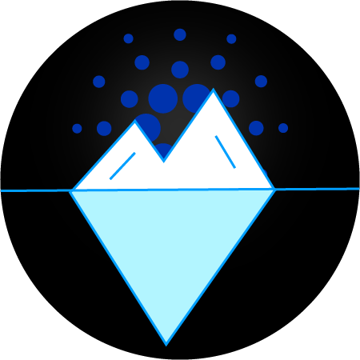

    

# Iceberg

A Cardano onchain data analytics plaform.

### Why Iceberg?
One important aspect of blockchain technology is that the onchain ledger is completely transparent where all transactions, smart contract interactions, and NFT mints can be seen and analyzed in plain sight. A challenge for Cardano is that this is not easy, be it the infrastructure requirements to do this, understanding data schemas and navigating UTXOs makes it no small feat for the data analyst. Other ecosystems have tools like Dune or Flipside which encourages users, project teams, and investors to build out analytics that they can trust and build insights from. Users can understand onchain trends, project teams can display meaningful analytics to their community from a transparent and confirmable source, community members can understand who is supporting what in governance and investors can understand which projects are gaining traction and shipping.

Iceberg also comes out of the need for continuing to build out a token engineering platform and project (https://thetokenlab.xyz) to support Cardano. Getting onchain data is possible, but currently requires very ad hoc solutions to be put together. Iceberg will help to design a systematic way of getting data that can be applied broadly to various narratives.

We have built relationships with data analysts in the Cardano space and this is a major ask for someone to build. In addition, we would leverage the relationships developed with builders in the Cardano Ecosystem to help guide and steer as the project kicks off.

### Why Now?
Cardano is at a unique crossroads where DeFi projects are starting to attract liquidity, DePIN is taking off, and generally, the builders are putting in the time to make Cardano a stronger ecosystem. As the ecosystem grows, we need people to help highlight the successes, understand trends, and explain why things are happening the way they are. This opens lots of opportunities for data analysts to support projects and help create awareness with easy-to-access data. Currently, the only onchain analytics that can be done is through explorers (which are cumbersome) or something like TapTools which only has fixed views and doesn't allow a user to establish and create their ways of connecting the dots.

### How to Build Iceberg?
The underpinnings of many data analytic platforms in the blockchain space are supporting a node and indexing solution and exposing the data through an SQL engine. This has proven to be one of the most accessible ways to get and connect onchain data for users for building out dashboards and visualizations. SQL is a very low-level language with a very low bar to learn, and allowing queries to be performed online and supported by visualizations will make the entry to draw out insights much easier than before.

### What's the Impact?
Dune and Flipside crypto have helped to level the playing field and give power to people to understand what's going onchain. Be it successful projects gaining traction, tracking whales and replicating their strategies, highlighting dReps action (or inaction), uncovering shady business, or simply helping airdrop hunters chase the next bag. The multitude of use cases for a data analytics platform is endless. Right now we trust projects to display real metrics, but with Iceberg users can self verify that themselves. Iceberg is the public good that we all need to make Cardano a more transparent and insightful platform for everyone.

This project is aimed to help serve the community and we already maintain contact with a wide variety of members from various projects and data analysts that we will actively work to seek feedback from to help ensure that Iceberg can meet the expectations of the users.  Feedback is crucial to making any project successful and we will be looking at taking in as much as we can throughout the building, testing, and demoing phase of the project.
